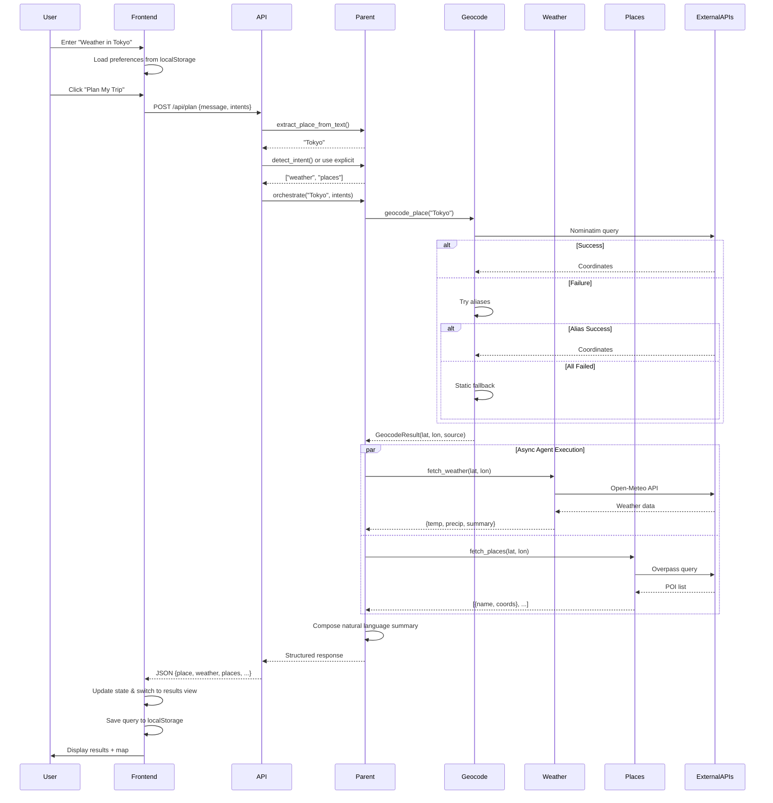

# 🌍 Multi-Agent Tourism Planner


A production-ready, AI-powered travel planning system that orchestrates specialized agents to provide real-time weather forecasts and tourist attractions for destinations worldwide.

---

## 📋 Table of Contents

- [Overview](#overview)
- [System Architecture](#system-architecture)
- [Features](#features)
- [Technology Stack](#technology-stack)
- [Project Structure](#project-structure)
- [Getting Started](#getting-started)
- [Configuration](#configuration)
- [API Documentation](#api-documentation)
- [Development Journey](#development-journey)
- [Deployment](#deployment)
- [Testing](#testing)
- [Contributing](#contributing)
- [License](#license)

---

## 🎯 Overview

The Multi-Agent Tourism Planner is a sophisticated web application that combines the power of multiple AI agents with real-world data sources to create personalized travel itineraries. The system intelligently processes natural language queries, geocodes locations, and aggregates weather forecasts with tourist attractions in a beautifully designed, responsive interface.

### What Makes This Special?

✅ **Multi-Agent Orchestration**: Parent agent coordinates specialized weather and places agents asynchronously  
✅ **Voice-Powered Search**: Hands-free destination input using Web Speech API  
✅ **7-Day Weather Forecast**: Detailed daily predictions with temperature, precipitation, and weather codes  
✅ **Drag & Drop Itinerary**: Interactive trip planner with customizable place ordering  
✅ **Save & Share Plans**: Generate shareable links to collaborate on travel plans  
✅ **Robust Geocoding**: Three-tier fallback system (Nominatim → Aliases → Static coordinates)  
✅ **Real-Time Data**: Live weather from Open-Meteo and POIs from OpenStreetMap Overpass  
✅ **Production-Ready**: Rate limiting, CORS security, input validation, error handling, retry logic, and caching  
✅ **Beautiful UI**: Glassmorphism design with welcome animation, smooth transitions, and interactive maps  
✅ **Mobile Responsive**: Optimized layouts for desktop, tablet, and mobile devices  

---

## 🏗️ System Architecture

### High-Level Architecture

```mermaid
graph TB
    subgraph "User Interface"
        BROWSER[Web Browser]
    end
    
    subgraph "Frontend - React SPA"
        APP[App.jsx - State Manager]
        INPUT[InputForm - Search Interface]
        RESULT[ResultCard - Data Display]
        MAP[MapView - Leaflet Map]
        STORAGE[localStorage - Persistence]
    end
    
    subgraph "Backend - FastAPI"
        API[/api/plan Endpoint]
        PARENT[Parent Agent - Orchestrator]
        
        subgraph "Specialized Agents"
            WEATHER[Weather Agent]
            PLACES[Places Agent]
        end
        
        subgraph "Services"
            GEO[Geocoding Service]
            OPENMETE[Open-Meteo Client]
            OVERP[Overpass Client]
        end
        
        subgraph "Utilities"
            RETRY[Retry Logic]
            CACHE[TTL Cache]
            LOG[Logging]
        end
    end
    
    subgraph "External APIs"
        NOM[Nominatim Geocoding]
        OM[Open-Meteo Weather]
        OVP[Overpass POI]
    end

    BROWSER <-->|HTTP/JSON| APP
    APP --> INPUT
    APP --> RESULT
    APP --> MAP
    INPUT <--> STORAGE
    
    INPUT -->|POST /api/plan| API
    API --> PARENT
    
    PARENT -->|Geocode| GEO
    PARENT -->|Async Calls| WEATHER
    PARENT -->|Async Calls| PLACES
    
    GEO -->|Query| NOM
    WEATHER -->|Fetch| OPENMETE
    PLACES -->|Fetch| OVERP
    
    OPENMETE --> OM
    OVERP --> OVP
    
    RETRY -.->|Decorates| WEATHER
    RETRY -.->|Decorates| PLACES
    RETRY -.->|Decorates| GEO
    
    CACHE -.->|Decorates| GEO
    CACHE -.->|Decorates| PLACES
    
    LOG -.->|Monitors| PARENT
    
    PARENT -->|Response| API
    API -->|JSON| INPUT
    INPUT -->|Update State| APP
    APP -->|Props| RESULT
    APP -->|Props| MAP

    style PARENT fill:#4cc9f0,stroke:#333,stroke-width:3px
    style WEATHER fill:#7209b7,stroke:#333,stroke-width:2px
    style PLACES fill:#7209b7,stroke:#333,stroke-width:2px
    style GEO fill:#f72585,stroke:#333,stroke-width:2px
    style APP fill:#3a86ff,stroke:#333,stroke-width:2px
```

### Request Flow



---

## ✨ Features

### Backend Capabilities

#### 🧠 Multi-Agent System
- **Parent Agent**: Orchestrates workflow, extracts location, detects intent
- **Weather Agent**: Fetches real-time weather + 7-day forecast with retry logic (3 attempts, exponential backoff)
- **Places Agent**: Retrieves tourist POIs with adaptive radius expansion and geo-coordinates

#### 🗺️ Advanced Geocoding
- **Nominatim Integration**: Primary geocoding with configurable user-agent
- **Alias Mapping**: Handles legacy names (e.g., "Bombay" → "Mumbai")
- **Static Fallback**: Offline coordinates for common cities
- **Source Tracking**: Frontend knows if static fallback was used

#### ⚡ Performance & Resilience
- **Async Execution**: Concurrent agent calls via `asyncio.gather()`
- **Rate Limiting**: Sliding window (30 req/60s per IP) to prevent abuse
- **CORS Security**: Environment-controlled origin whitelist
- **Input Validation**: 2-500 character limits with Pydantic schemas
- **TTL Caching**: 5-minute cache for geocoding, 10-minute for POIs
- **Exponential Backoff**: Automatic retries for transient API failures
- **Partial Failure Handling**: Returns available data even if one agent fails

#### 📊 Observability
- **Structured Logging**: JSON logs with contextual fields (lat, lon, query)
- **Error Aggregation**: Collected errors returned in response
- **Health Endpoint**: `/health` for monitoring

### Frontend Features

#### 🎨 Modern UI/UX
- **Welcome Animation**: Engaging 1.5-second intro with gradient text and bouncing airplane
- **Glassmorphism Design**: Translucent cards with backdrop blur
- **Blue/Cyan Theme**: Calming, travel-oriented color palette
- **Smooth Animations**: Plane loader, skeleton loaders, shimmer effects, fade transitions
- **Responsive Layout**: Mobile-first design with 3 breakpoints (1024px, 768px, 480px)
- **Smart Scrolling**: Search bar hides on scroll down, reappears on scroll up

#### 🧭 Interactive Components
- **Voice Input**: Microphone button with Web Speech API for hands-free search
- **Intent Toggles**: Explicit weather/places selection (🌤️ | 🗺️)
- **7-Day Forecast Cards**: Visual weather cards with emoji icons, temps, and precipitation
- **Drag & Drop Builder**: react-beautiful-dnd powered itinerary with reorderable items
- **Share Plans**: Generate unique URLs with localStorage-based plan sharing
- **Leaflet Map**: Interactive map with location + POI markers
- **Expandable Textarea**: Multi-line input that grows with content
- **Loading States**: Skeleton cards + animated plane during API calls

#### 💾 State Management
- **localStorage Persistence**: Query and toggle preferences saved
- **View Switching**: Seamless transition between landing and results
- **Error Display**: User-friendly error messages
- **Fallback Badge**: Yellow warning when static geocoding used

---

## 🛠️ Technology Stack

### Backend

| Technology | Version | Purpose |
|------------|---------|---------|
| **Python** | 3.11+ | Core language |
| **FastAPI** | 0.104.1 | Web framework |
| **Uvicorn** | 0.24.0 | ASGI server |
| **httpx** | 0.25.0 | Async HTTP client |
| **Pydantic** | 2.4.2 | Data validation |
| **python-dotenv** | 1.0.0 | Environment config |

### Frontend

| Technology | Version | Purpose |
|------------|---------|---------|
| **React** | 18.2.0 | UI library |
| **Vite** | 5.0.0 | Build tool |
| **Axios** | 1.6.0 | HTTP client |
| **Leaflet** | 1.9.4 | Map rendering |
| **react-beautiful-dnd** | 13.1.1 | Drag & drop |

### External APIs

| API | Purpose | Limits |
|-----|---------|--------|
| **Nominatim** | Geocoding | 1 req/sec (cached) |
| **Open-Meteo** | Weather data | No limits (free tier) |
| **Overpass** | OSM POI data | Fair use policy |

---

## 📁 Project Structure

```
multi-agent-tourism/
├── backend/
│   ├── app/
│   │   ├── agents/
│   │   │   ├── parent_agent.py      # Orchestrator
│   │   │   ├── weather_agent.py     # Weather specialist
│   │   │   └── places_agent.py      # Places specialist
│   │   ├── api/
│   │   │   └── plan.py              # /api/plan endpoint
│   │   ├── services/
│   │   │   ├── geocode.py           # Nominatim + fallbacks
│   │   │   ├── open_meteo.py        # Weather API client
│   │   │   └── overpass.py          # POI API client
│   │   ├── utils/
│   │   │   ├── retry.py             # Exponential backoff
│   │   │   ├── cache.py             # TTL cache decorator
│   │   │   └── logging_config.py    # Structured logging
│   │   └── main.py                  # FastAPI app
│   ├── docs/
│   │   └── ARCHITECTURE.md          # Backend architecture details
│   ├── requirements.txt
│   └── .env.example
├── frontend/
│   ├── src/
│   │   ├── components/
│   │   │   ├── Navbar.jsx           # Navigation
│   │   │   ├── Landing.jsx          # Hero section
│   │   │   ├── InputForm.jsx        # Search + toggles
│   │   │   ├── ResultCard.jsx       # Results display
│   │   │   ├── MapView.jsx          # Leaflet map
│   │   │   ├── Features.jsx         # Feature showcase
│   │   │   └── HowItWorks.jsx       # Usage guide
│   │   ├── api/
│   │   │   └── planApi.js           # Backend client
│   │   ├── App.jsx                  # Main container
│   │   ├── main.jsx                 # Entry point
│   │   └── styles.css               # Global styles
│   ├── docs/
│   │   └── ARCHITECTURE.md          # Frontend architecture details
│   ├── package.json
│   └── .env.example
└── README.md                        # This file
```

---

## 🚀 Getting Started

### Prerequisites

- **Python**: 3.11 or higher
- **Node.js**: 18+ and npm
- **Git**: For cloning the repository

### Installation

#### 1. Clone the Repository
```bash
git clone https://github.com/yourusername/multi-agent-tourism.git
cd multi-agent-tourism
```

#### 2. Backend Setup
```bash
cd backend

# Create virtual environment (recommended)
python -m venv venv
source venv/bin/activate  # On Windows: venv\Scripts\activate

# Install dependencies
pip install -r requirements.txt

# Create .env file
cp .env.example .env
# Edit .env and set USER_AGENT to your email/app name
```

#### 3. Frontend Setup
```bash
cd frontend

# Install dependencies
npm install

# Create .env file
cp .env.example .env
# Edit .env and set VITE_BACKEND_URL if backend isn't on localhost:8000
```

### Running the Application

#### Terminal 1: Start Backend
```bash
cd backend
uvicorn app.main:app --reload
```
Backend runs on `http://localhost:8000`

#### Terminal 2: Start Frontend
```bash
cd frontend
npm run dev
```
Frontend runs on `http://localhost:5173`

#### Open in Browser
Navigate to `http://localhost:5173` and start planning your trips!

---

## ⚙️ Configuration

### Backend Environment Variables

Create `backend/.env`:
```bash
# REQUIRED: Nominatim user-agent (include contact email)
USER_AGENT=tourism-planner/1.0 (+your-email@example.com)

# Logging level (DEBUG, INFO, WARNING, ERROR)
LOG_LEVEL=INFO

# CORS origins (comma-separated for production)
ALLOWED_ORIGINS=*
```

### Frontend Environment Variables

Create `frontend/.env`:
```bash
# Backend API URL
VITE_BACKEND_URL=http://localhost:8000
```

---

## 📡 API Documentation

### POST `/api/plan`

**Request**:
```json
{
  "message": "Weather and places in Paris",
  "intents": ["weather", "places"]
}
```

**Response**:
```json
{
  "place": "Paris, France",
  "lat": 48.8566,
  "lon": 2.3522,
  "geocode_source": "nominatim",
  "weather": {
    "temperature": 15.0,
    "precipitation_probability": 20,
    "summary": "Partly Cloudy"
  },
  "places": ["Eiffel Tower", "Louvre Museum"],
  "text": "It's currently 15°C with a 20% chance of precipitation...",
  "errors": null
}
```

### GET `/health`

**Response**:
```json
{
  "status": "ok",
  "time": "2025-11-22T10:30:00.000000+00:00"
}
```

---

## 📖 Development Journey

### Phase 1: Foundation
✅ FastAPI backend + React frontend  
✅ Multi-agent system (parent, weather, places)  
✅ External API integration  

### Phase 2: Reliability
✅ Three-tier geocoding fallback  
✅ Retry logic with exponential backoff  
✅ TTL caching  
✅ Structured logging  

### Phase 3: UI/UX
✅ Glassmorphism design  
✅ Animations (plane loader, skeleton cards)  
✅ Interactive Leaflet maps  
✅ Responsive layout  

### Phase 4: Features
✅ Explicit intent toggles  
✅ Static fallback badge  
✅ localStorage persistence  
✅ Skeleton loaders with shimmer  

### Phase 5: Documentation
✅ Comprehensive architecture docs  
✅ Mermaid diagrams  
✅ API reference  
✅ Complete README  

---

## 🚢 Deployment

### Backend (Render/Heroku)
```bash
# Start command
uvicorn app.main:app --host 0.0.0.0 --port $PORT
```

### Frontend (Vercel/Netlify)
```bash
# Build command
npm run build

# Output directory
dist/
```

---

## 🧪 Testing

### Backend Tests

**Run tests**:
```bash
cd backend
python -m pytest -v

# With coverage report
python -m pytest --cov=app --cov-report=term-missing
```

**Test Results**:
```
✅ 5/5 tests passing
⏱️  Execution time: ~2-5 seconds
📊 Code coverage: 58%

Test Suite:
  ✓ test_geocode.py::test_geocode_place_parses_top_three_unique
  ✓ test_orchestrator.py::test_orchestrate_happy_path
  ✓ test_orchestrator.py::test_orchestrate_partial_failure
  ✓ test_places.py::test_fetch_pois_parses_and_limits
  ✓ test_weather.py::test_fetch_open_meteo_time_matching_precip

Coverage by Module:
  services/overpass.py       77%  ✅ POI parsing & query building
  services/open_meteo.py     74%  ✅ Weather data extraction
  utils/cache.py             71%  ✅ TTL caching decorator
  agents/weather_agent.py    70%  ✅ Retry logic & error handling
  agents/parent_agent.py     65%  ✅ Orchestration & intent detection
  services/geocode.py        52%  ⚠️  Fallback mechanisms
  agents/places_agent.py     41%  ⚠️  Radius expansion logic
```

### Frontend Tests

```bash
cd frontend
npm test
```

**Test Coverage**: Unit tests recommended for InputForm, ResultCard, MapView, and App components.

---

## 📚 Documentation

- [Backend Architecture](docs/BACKEND.md)
- [Frontend Architecture](docs/FRONTEND.md)

---

## 📄 License

MIT License. Comply with external API terms (Nominatim, Open-Meteo, Overpass).

---

**Built with ❤️ by Pranav** | *Last Updated: November 22, 2025*
