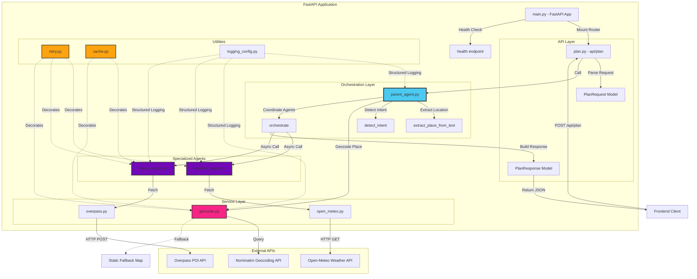
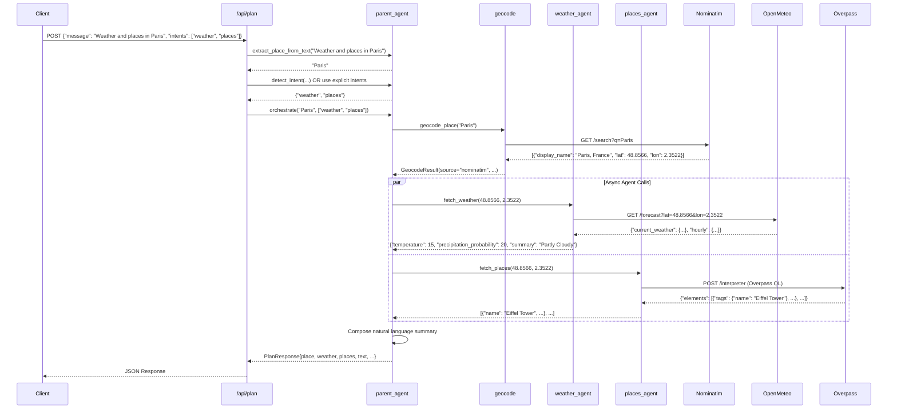

# Backend Architecture Documentation

## Overview

The backend is a **FastAPI-based multi-agent tourism orchestration system** that coordinates specialized agents to provide weather forecasts and tourist attractions for any location worldwide. The architecture follows a modular, asynchronous design pattern with robust error handling, caching, and retry mechanisms.

---

## Architecture Diagram



---

## Component Details

### 1. **main.py** - Application Entrypoint

**Purpose**: Bootstraps the FastAPI application with CORS, logging, and routing.

**Key Features**:
- **FastAPI App Initialization**: Creates the app instance with metadata (title, version, description)
- **CORS Middleware**: Configured for development with permissive origins (should be restricted in production)
- **Environment Configuration**: Loads `.env` file for configurable settings (`USER_AGENT`, `LOG_LEVEL`)
- **Health Endpoint**: `/health` returns service status and current UTC timestamp
- **Router Mounting**: Includes the plan router at `/api` prefix
- **Lifecycle Events**: Startup/shutdown hooks for logging service state

**Dependencies**:
```python
from fastapi import FastAPI
from fastapi.middleware.cors import CORSMiddleware
from dotenv import load_dotenv
```

**Environment Variables**:
- `USER_AGENT`: Custom user agent for external API requests (Nominatim compliance)
- `LOG_LEVEL`: Logging verbosity (default: `INFO`)

---

### 2. **api/plan.py** - Request Handler

**Purpose**: Defines the `/api/plan` endpoint that accepts user requests and returns orchestrated tourism data.

**Request Model (`PlanRequest`)**:
```python
class PlanRequest(BaseModel):
    message: str          # User's free-text query (e.g., "Weather in Paris")
    intents: Optional[List[str]] = None  # Explicit intents: ["weather", "places"]
```

**Response Model (`PlanResponse`)**:
```python
class PlanResponse(BaseModel):
    place: str                           # Resolved location name
    lat: Optional[float]                 # Latitude
    lon: Optional[float]                 # Longitude
    geocode_source: Optional[str]        # "nominatim" or "static"
    weather: Optional[Dict[str, Any]]    # Weather data block
    places: Optional[List[str]]          # Place names
    places_geo: Optional[List[Dict]]     # Place coords + metadata
    text: str                            # Natural language summary
    errors: Optional[List[str]]          # Error messages
```

**Request Flow**:
1. Parse incoming `PlanRequest`
2. Extract place candidate from message using heuristics (prepositions + capitalization)
3. Determine intents (explicit from payload or detected from keywords)
4. Clean and normalize place name (strip punctuation if geocoding fails)
5. Call `orchestrate()` from parent agent
6. Return structured `PlanResponse`

**Error Handling**:
- Returns HTTP 500 with error details if orchestration fails
- Partial failures (e.g., weather service down) captured in `errors` field
- Graceful degradation: returns available data even if some agents fail

---

### 3. **agents/parent_agent.py** - Orchestrator

**Purpose**: The "brain" that coordinates all specialized agents and composes the final response.

**Core Functions**:

#### `extract_place_from_text(message: str) -> Optional[str]`
- **Regex Pattern**: `\b(?:in|at|for|to)\s+([A-Z][A-Za-z0-9'\- ]{2,})`
- **Logic**: Looks for prepositions followed by capitalized words
- **Example**: "Weather in Tokyo" → extracts "Tokyo"
- **Fallback**: Returns `None` if no match found

#### `detect_intent(message: str) -> Set[str]`
- **Weather Keywords**: `{"weather", "temperature", "rain", "sunny", "forecast"}`
- **Places Keywords**: `{"place", "places", "attraction", "visit", "tour", "tourist", "poi"}`
- **Logic**: Case-insensitive keyword matching
- **Default**: Empty set (caller interprets as "both")

#### `orchestrate(place_candidate: Optional[str], want: List[str]) -> Dict[str, Any]`
**Orchestration Flow**:
1. **Geocoding Phase**:
   - Call `_resolve_place()` to get coordinates
   - If geocoding fails, return error immediately
   - Extracts `lat`, `lon`, `display_name`, `source` from `GeocodeResult`

2. **Agent Coordination Phase**:
   - Create async tasks based on `want` list
   - Launch `weather_agent.fetch_weather()` if "weather" in intents
   - Launch `places_agent.fetch_places()` if "places" in intents
   - Use `asyncio.gather()` with `return_exceptions=True` for concurrent execution

3. **Response Composition Phase**:
   - Extract weather data (temperature, precipitation, summary)
   - Extract places list (names + coordinates)
   - Build natural language summary
   - Collect any errors from failed agents
   - Return structured dictionary

**Error Handling**:
- Catches `ValueError` for geocoding failures
- Wraps agent calls in try/except to isolate failures
- Returns partial data with error messages

---

### 4. **agents/weather_agent.py** - Weather Specialist

**Purpose**: Fetches current weather data for coordinates using Open-Meteo API.

**Decorator Stack**:
```python
@async_retry(retries=3, backoff_factor=0.5)
async def fetch_weather(lat: float, lon: float) -> Dict[str, Any]
```

**Retry Behavior**:
- **Attempts**: 3 total (initial + 2 retries)
- **Backoff**: Exponential (0.5s, 1.0s, 2.0s)
- **Exceptions**: Catches all `Exception` types

**Response Schema**:
```python
{
    "temperature": float,              # Celsius
    "precipitation_probability": int,  # Percentage
    "summary": str                     # Human-readable (e.g., "Partly Cloudy")
}
```

**Error Response**:
```python
{"error": "Weather service temporarily unavailable"}
```

---

### 5. **agents/places_agent.py** - Places Specialist

**Purpose**: Fetches tourist points of interest (POIs) using Overpass API with adaptive radius expansion.

**Decorator Stack**:
```python
@ttl_cache(ttl_seconds=600)
@async_retry(retries=3, backoff_factor=0.4)
async def _fetch(...) -> List[Dict[str, Any]]
```

**Caching**: 10-minute TTL to reduce API load

**Radius Expansion Logic**:
1. Start with `DEFAULT_RADIUS = 5000` meters
2. If results < `POI_LIMIT = 5`:
   - Expand radius by `RADIUS_EXPANSION_FACTOR = 2`
   - Retry up to `MAX_EXPANSIONS = 1` times
3. Deduplicate results by name across expansions
4. Truncate to `POI_LIMIT`

**Response Schema**:
```python
[
    {
        "name": str,
        "category": Optional[str],  # e.g., "tourism:attraction"
        "lat": Optional[float],
        "lon": Optional[float]
    },
    ...
]
```

---

### 6. **services/geocode.py** - Geocoding Service

**Purpose**: Resolves place names to coordinates using Nominatim with fallback mechanisms.

**Three-Tier Fallback Strategy**:

#### Tier 1: Nominatim Query
- **Endpoint**: `https://nominatim.openstreetmap.org/search`
- **Parameters**: `q`, `format=json`, `limit=5`
- **User-Agent**: Configurable via `USER_AGENT` env var (required by Nominatim)
- **Retry Logic**: 3 attempts with exponential backoff (0.5s → 1.0s → 2.0s)
- **Rate Limiting**: Returns error if HTTP 429 received

#### Tier 2: Alias Expansion
**Alias Map** (partial list):
```python
{
    "bangalore": ["bengaluru", "bengaluru, india"],
    "bombay": ["mumbai", "mumbai, india"],
    "paris": ["paris, france"],
    "new york": ["new york, usa", "new york city"],
    ...
}
```
- **Logic**: If primary query fails, try each alias variant
- **Use Case**: Handles legacy names, common abbreviations

#### Tier 3: Static Fallback
**Static Coordinates Map**:
```python
{
    "bengaluru": ("Bengaluru, India", 12.9716, 77.5946),
    "goa": ("Goa, India", 15.2993, 74.1240),
    "paris": ("Paris, France", 48.8566, 2.3522),
    ...
}
```
- **Trigger**: If Nominatim and aliases both fail
- **Source Tag**: Results marked with `source="static"`
- **Use Case**: Offline resilience, API outages

**GeocodeResult Model**:
```python
@dataclass(slots=True)
class GeocodeResult:
    display_name: str   # Full location name
    lat: float          # Latitude
    lon: float          # Longitude
    source: str         # "nominatim" or "static"
```

**Caching**:
- **TTL**: 300 seconds (5 minutes)
- **Implementation**: `@ttl_cache` decorator or fallback manual cache

---

### 7. **services/open_meteo.py** - Weather Data Service

**Purpose**: Query Open-Meteo API for current weather and hourly precipitation.

**API Endpoint**: `https://api.open-meteo.com/v1/forecast`

**Request Parameters**:
```python
{
    "latitude": float,
    "longitude": float,
    "current_weather": "true",
    "hourly": "precipitation_probability",
    "timezone": str  # Default: "Asia/Kolkata"
}
```

**Response Processing**:
1. **Temperature Extraction**: `current_weather.temperature`
2. **Precipitation Matching**:
   - Match `current_weather.time` to `hourly.time` array
   - Extract corresponding `hourly.precipitation_probability` value
3. **Weather Summary**:
   - Map `current_weather.weathercode` to human-readable string
   - **Code Map** (examples):
     ```python
     {
         0: "Clear",
         2: "Partly Cloudy",
         61: "Slight Rain",
         95: "Thunderstorm",
         ...
     }
     ```

**Error Handling**:
- Raises `httpx.HTTPError` for network failures
- Returns `None` for missing fields (graceful degradation)
- Timeout: 10 seconds

---

### 8. **services/overpass.py** - POI Data Service

**Purpose**: Query Overpass API for OpenStreetMap points of interest.

**API Endpoint**: `https://overpass-api.de/api/interpreter`

**Overpass QL Query Structure**:
```overpass
[out:json][timeout:25];
(
    nwr[tourism=attraction](around:5000,lat,lon);
    nwr[leisure=park](around:5000,lat,lon);
    nwr[historic](around:5000,lat,lon);
);
out center;
```

**Priority Filters**:
- `tourism=attraction`: Museums, viewpoints, monuments
- `leisure=park`: Parks, gardens
- `historic`: Historical sites, ruins

**Parsing Logic**:
1. Extract elements from JSON response
2. Filter for named POIs (`name` or `name:en` tag)
3. Deduplicate by name
4. Extract category from tags (`tourism:*`, `leisure:*`, `historic:*`)
5. Extract coordinates:
   - **Node**: Direct `lat`/`lon`
   - **Way/Relation**: Use `center.lat`/`center.lon`

**Response Schema**:
```python
[
    {
        "name": "Eiffel Tower",
        "category": "tourism:attraction",
        "lat": 48.8584,
        "lon": 2.2945
    },
    ...
]
```

---

### 9. **utils/retry.py** - Retry Decorator

**Purpose**: Exponential backoff retry logic for async functions.

**Implementation**:
```python
@async_retry(retries=3, backoff_factor=0.5)
async def some_function():
    # Will retry on failure with delays: 0.5s, 1.0s, 2.0s
    ...
```

**Parameters**:
- `retries`: Total attempts (including initial call)
- `backoff_factor`: Base multiplier for exponential delay
- `exceptions`: Tuple of exception types to catch (default: all)

**Backoff Formula**: `delay = backoff_factor * (2 ** (attempt - 1))`

**Use Cases**:
- Transient network failures
- Rate limiting (429 responses)
- Temporary API unavailability

---

### 10. **utils/cache.py** - TTL Cache

**Purpose**: In-memory time-to-live caching for expensive operations.

**Implementation**:
```python
@ttl_cache(ttl_seconds=600)
async def expensive_api_call(arg):
    # Result cached for 10 minutes
    ...
```

**Cache Storage**:
- **Key**: `(function_name, args_tuple, kwargs_sorted_tuple)`
- **Value**: `(expiry_timestamp, result)`
- **Eviction**: Lazy (checked on access)

**Features**:
- Supports both sync and async functions
- Thread-unsafe (adequate for single-process async)
- Automatic key generation from function signature

**Use Cases**:
- Geocoding results (same place queried multiple times)
- Places data (POIs stable over short periods)
- Rate limit mitigation

---

### 11. **utils/logging_config.py** - Structured Logging

**Purpose**: Configurable structured logging for debugging and monitoring.

**Features**:
- JSON-formatted logs for production parsing
- Contextual fields (e.g., `lat`, `lon`, `query`)
- Log level filtering via `LOG_LEVEL` env var

**Usage**:
```python
from ..utils.logging_config import logger

logger.info("Geocode request", query=query, lat=lat, lon=lon)
logger.warning("API failure", error=str(exc), retry_attempt=2)
logger.error("Critical failure", error_type=type(exc).__name__)
```

---

## Data Flow Example

**User Request**: `"Weather and places in Paris"`



---

## Error Handling Strategy

### 1. **Layered Resilience**
- **Retry Decorators**: Automatic retries for transient failures
- **Fallback Data**: Static coordinates when geocoding fails
- **Partial Success**: Return available data even if some agents fail

### 2. **Error Propagation**
- **Service Layer**: Raises specific exceptions (`ValueError`, `httpx.HTTPError`)
- **Agent Layer**: Catches exceptions, returns error dictionaries
- **Orchestrator**: Aggregates errors into `errors` list
- **API Layer**: Returns HTTP 500 with structured error details

### 3. **Logging**
- **Debug**: Cache hits, query construction
- **Info**: Successful API calls, resolved locations
- **Warning**: Retry attempts, fallback usage
- **Error**: Critical failures with exception types

---

## Configuration

### Environment Variables

**`.env` File**:
```bash
# Nominatim User-Agent (REQUIRED by usage policy)
USER_AGENT=tourism-orchestrator/1.0 (+https://yoursite.com/contact)

# Logging verbosity
LOG_LEVEL=INFO

# CORS origins (production)
ALLOWED_ORIGINS=https://yourdomain.com
```

### Constants (Modifiable in Code)

**geocode.py**:
- `ALIAS_MAP`: Add legacy/alternate place names
- `STATIC_FALLBACK_RAW`: Add offline coordinate fallbacks

**places_agent.py**:
- `DEFAULT_RADIUS`: Initial search radius (5000m)
- `POI_LIMIT`: Maximum results returned (5)
- `MAX_EXPANSIONS`: Radius expansion attempts (1)

**open_meteo.py**:
- `DEFAULT_TIMEZONE`: Timezone for weather data (`Asia/Kolkata`)
- `WEATHER_CODE_MAP`: Extend weather code descriptions

**overpass.py**:
- `PRIORITY_FILTERS`: Add/modify POI tag filters

---

## Performance Optimizations

### 1. **Asynchronous Execution**
- All I/O operations use `async`/`await`
- Agents run concurrently via `asyncio.gather()`
- Non-blocking HTTP clients (`httpx.AsyncClient`)

### 2. **Caching**
- Geocode results cached for 5 minutes
- Places results cached for 10 minutes
- Cache keys include all parameters

### 3. **Request Efficiency**
- Overpass queries optimized with `out center` (reduces payload)
- Open-Meteo requests only current + hourly precipitation
- Nominatim limited to 5 results

### 4. **Error Short-Circuiting**
- Geocoding failure returns early (no agent calls)
- Agent failures don't block other agents
- Timeouts prevent indefinite waits

---

## Testing Strategies

### Unit Tests (Recommended)
```python
# Test geocoding fallback
async def test_geocode_static_fallback():
    result = await geocode_place("UnknownCity")
    assert result is None or result.source == "static"

# Test weather agent error handling
async def test_weather_service_down():
    with patch("httpx.AsyncClient.get", side_effect=httpx.HTTPError):
        result = await fetch_weather(0, 0)
        assert "error" in result
```

### Integration Tests
- Mock external APIs (Nominatim, Open-Meteo, Overpass)
- Test full orchestration flow
- Verify error aggregation

### Load Tests
- Concurrent request handling
- Cache hit rate analysis
- Rate limit behavior

---

## Deployment Considerations

### Production Checklist
- [ ] Set `ALLOWED_ORIGINS` to specific domains (not `*`)
- [ ] Configure `USER_AGENT` with real contact info
- [ ] Set `LOG_LEVEL=WARNING` or `ERROR`
- [ ] Enable HTTPS/TLS
- [ ] Set up monitoring (e.g., Sentry, Datadog)
- [ ] Configure rate limiting middleware
- [ ] Review timeout values for production latency

### Scaling Strategies
- **Horizontal Scaling**: Stateless design supports load balancing
- **Caching Layer**: Add Redis for distributed caching
- **CDN**: Cache geocoding results at edge
- **Database**: Persist popular queries to reduce API calls

---

## Dependencies

**Core**:
- `fastapi`: Web framework
- `uvicorn`: ASGI server
- `httpx`: Async HTTP client
- `pydantic`: Data validation
- `python-dotenv`: Environment configuration

**Development**:
- `pytest`: Testing framework
- `pytest-asyncio`: Async test support

---

## API Reference

### POST `/api/plan`

**Request**:
```json
{
  "message": "Weather in Tokyo",
  "intents": ["weather", "places"]  // Optional
}
```

**Response (Success)**:
```json
{
  "place": "Tokyo, Japan",
  "lat": 35.6762,
  "lon": 139.6503,
  "geocode_source": "nominatim",
  "weather": {
    "temperature": 18,
    "precipitation_probability": 10,
    "summary": "Partly Cloudy"
  },
  "places": ["Senso-ji Temple", "Tokyo Tower", "Meiji Shrine"],
  "places_geo": [
    {"name": "Senso-ji Temple", "category": "tourism:attraction", "lat": 35.7148, "lon": 139.7967}
  ],
  "text": "It's currently 18°C with a 10% chance of precipitation. Places you can visit: Senso-ji Temple, Tokyo Tower, Meiji Shrine.",
  "errors": null
}
```

**Response (Partial Failure)**:
```json
{
  "place": "Paris, France",
  "lat": 48.8566,
  "lon": 2.3522,
  "geocode_source": "nominatim",
  "weather": {"error": "Weather service temporarily unavailable"},
  "places": ["Eiffel Tower", "Louvre Museum"],
  "text": "Places you can visit: Eiffel Tower, Louvre Museum.",
  "errors": ["Weather service unavailable"]
}
```

**Response (Geocoding Failure)**:
```json
{
  "place": "Atlantis",
  "weather": null,
  "places": null,
  "text": "I couldn't resolve the place 'Atlantis'.",
  "errors": ["I don't know this place exists."]
}
```

---

## Future Enhancements

1. **Multi-Language Support**: Detect user language, return localized results
2. **Date Range Queries**: "Weather in Paris next week"
3. **Recommendation Engine**: Personalized POI suggestions based on preferences
4. **Authentication**: API key management for rate limiting
5. **Database Layer**: Store popular queries, user history
6. **Webhooks**: Notify clients of weather alerts
7. **GraphQL API**: Flexible querying for mobile clients

---

## Troubleshooting

### Common Issues

**Issue**: `ValueError: I don't know this place exists.`
- **Cause**: Geocoding failed for all tiers (Nominatim, aliases, static)
- **Solution**: Add place to `ALIAS_MAP` or `STATIC_FALLBACK_RAW`

**Issue**: `Weather service temporarily unavailable`
- **Cause**: Open-Meteo API down or rate-limited
- **Solution**: Check API status, increase retry backoff

**Issue**: Empty places list
- **Cause**: No POIs found within search radius
- **Solution**: Increase `DEFAULT_RADIUS` or `MAX_EXPANSIONS`

**Issue**: HTTP 429 from Nominatim
- **Cause**: Rate limit exceeded
- **Solution**: Increase cache TTL, add request throttling

---

## Maintainer Notes

- **Code Style**: Follow PEP 8, use type hints
- **Documentation**: Update this file when adding new agents/services
- **Testing**: Maintain >80% coverage for critical paths
- **Versioning**: Use semantic versioning (MAJOR.MINOR.PATCH)

---

*Last Updated: 2025-11-22*
