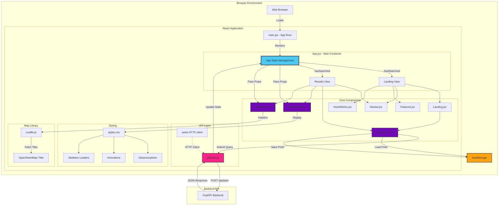
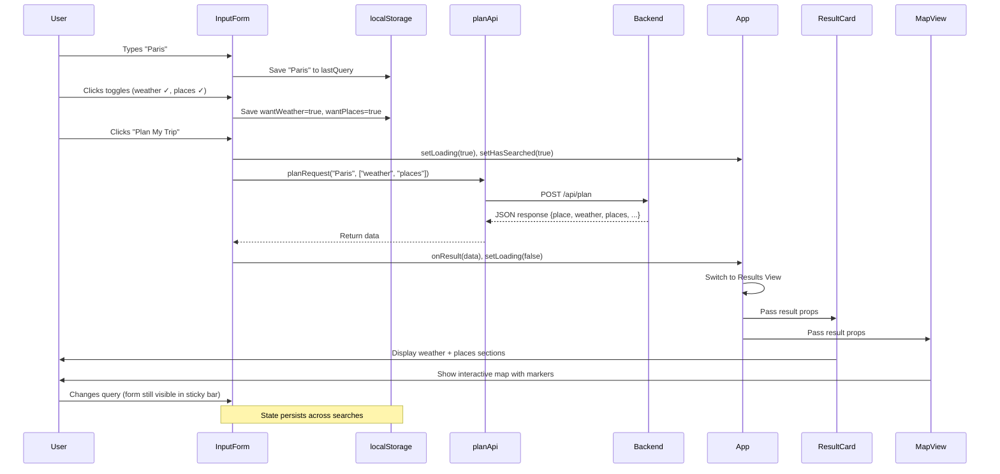

# Frontend Architecture Documentation

## Overview

The frontend is a **React + Vite single-page application (SPA)** that provides an intuitive, visually stunning interface for the multi-agent tourism system. Built with modern web technologies, it features glassmorphism design, real-time interactive maps, persistent user preferences, and responsive loading states.

---

## Architecture Diagram



---

## Component Details

### 1. **main.jsx** - Application Entry Point

**Purpose**: Bootstrap the React application and mount to DOM.

**Code**:
```jsx
import React from 'react';
import ReactDOM from 'react-dom/client';
import App from './App.jsx';
import './styles.css';

ReactDOM.createRoot(document.getElementById('root')).render(
  <React.StrictMode>
    <App />
  </React.StrictMode>
);
```

**Key Features**:
- **React 18 Concurrent Mode**: Uses `createRoot` API
- **Strict Mode**: Enables development warnings and checks
- **Global Styles**: Imports main stylesheet
- **Single Root**: Mounts `<App />` component

---

### 2. **App.jsx** - Main Container & State Manager

**Purpose**: Centralized state management and view routing (landing vs results).

**State Variables**:
```jsx
const [result, setResult] = useState(null);       // API response data
const [loading, setLoading] = useState(false);    // Loading state
const [error, setError] = useState(null);         // Error message
const [hasSearched, setHasSearched] = useState(false); // View toggle
const [theme, setTheme] = useState('default');    // Theme (future use)
```

**View Logic**:
```jsx
{!hasSearched && (
  // Landing View: Hero section + Features + How It Works
)}
{hasSearched && (
  // Results View: Sticky search bar + Results + Map
)}
```

**Component Hierarchy**:
```
App
├── Navbar (always visible)
├── Landing View (before search)
│   ├── Landing (hero section)
│   │   └── InputForm
│   ├── Features
│   ├── HowItWorks
│   └── Footer
└── Results View (after search)
    ├── Sticky Search Bar
    │   └── InputForm
    ├── Loading State
    │   ├── Plane Animation
    │   └── Skeleton Cards
    ├── Error Display
    ├── Result Layout
    │   ├── ResultCard
    │   └── MapView
    └── Footer
```

**State Flow**:
1. User submits query → `setLoading(true)`, `setHasSearched(true)`
2. API response → `setResult(data)`, `setLoading(false)`
3. Error → `setError(message)`

---

### 3. **components/Navbar.jsx** - Navigation Header

**Purpose**: Top navigation bar with branding and future nav links.

**Features**:
- **Logo/Brand**: "✈️ TravelAI" or custom branding
- **Navigation Links**: Home, About, Contact (configurable)
- **Sticky Positioning**: Remains visible on scroll
- **Glassmorphism**: Translucent background with backdrop blur

**Styling**:
```css
.navbar {
  background: rgba(255, 255, 255, 0.05);
  backdrop-filter: blur(10px);
  border-bottom: 1px solid rgba(76, 201, 240, 0.2);
}
```

---

### 4. **components/Landing.jsx** - Hero Section

**Purpose**: Eye-catching hero area with tagline and main search form.

**Structure**:
```jsx
<section className="hero">
  <h1 className="hero-title">Plan Your Perfect Trip</h1>
  <p className="hero-subtitle">
    AI-powered travel assistant for weather & attractions
  </p>
  {children} {/* InputForm passed as child */}
</section>
```

**Features**:
- **Gradient Background**: Animated gradient with blue/cyan theme
- **Floating Icons**: Animated plane/globe/compass icons
- **Call-to-Action**: Prominent search input

**Animations**:
- Title fade-in with slide-up
- Icon float/pulse effects
- Background gradient shift

---

### 5. **components/InputForm.jsx** - Search Interface

**Purpose**: Unified search input with intent toggles and state persistence.

**State Management**:
```jsx
const [message, setMessage] = useState('');        // Search query
const [wantWeather, setWantWeather] = useState(true);  // Weather toggle
const [wantPlaces, setWantPlaces] = useState(true);    // Places toggle
```

**localStorage Persistence**:
```jsx
// Load on mount
useEffect(() => {
  setMessage(localStorage.getItem('lastQuery') || '');
  setWantWeather(localStorage.getItem('wantWeather') === 'true');
  setWantPlaces(localStorage.getItem('wantPlaces') === 'true');
}, []);

// Save on change
useEffect(() => {
  localStorage.setItem('lastQuery', message);
}, [message]);
```

**Submit Flow**:
```jsx
const handleSubmit = async (e) => {
  e.preventDefault();
  setError(null);
  onResult(null);
  setLoading(true);
  
  const intents = [];
  if (wantWeather) intents.push('weather');
  if (wantPlaces) intents.push('places');
  
  const data = await planRequest(message, intents);
  onResult(data);
  setLoading(false);
};
```

**UI Elements**:
- **Text Input**: Glassmorphic input with placeholder
- **Toggle Buttons**: 🌤️ Weather | 🗺️ Places (active state highlights)
- **Submit Button**: Gradient CTA button "Plan My Trip"

**Styling Features**:
- Input focus state with cyan glow
- Active toggle with blue gradient
- Hover effects on buttons
- Responsive layout (stacks on mobile)

---

### 6. **components/ResultCard.jsx** - Results Display

**Purpose**: Display orchestrated tourism data in organized sections.

**Section Structure**:
```jsx
<div className="result-card-grid">
  {/* Summary Section */}
  <section className="summary-section">
    <h2>Summary</h2>
    <p>{text}</p>
    {errors && <ul>{errors.map(...)}</ul>}
  </section>
  
  {/* Weather Section (conditional) */}
  {hasWeather && (
    <section className="weather-section">
      <h3>Weather</h3>
      <p>Temperature: {temperature}°C</p>
      <p>Precipitation: {precipitation_probability}%</p>
      <p>Summary: {summary}</p>
    </section>
  )}
  
  {/* Places Section (conditional) */}
  {hasPlaces && (
    <section className="places-section">
      <h3>Places</h3>
      <ul>{places.map(p => <li>{p}</li>)}</ul>
    </section>
  )}
  
  {/* Metadata Section */}
  <section className="meta-section">
    <p>Resolved Place: {place}</p>
    <p>Coordinates: {lat}, {lon}</p>
    {geocode_source === 'static' && (
      <p className="fallback-badge">
        Using static location fallback.
      </p>
    )}
  </section>
</div>
```

**Conditional Rendering**:
- **Weather**: Only if `weather` object present and no error
- **Weather Error**: Red-bordered section if `weather.error` exists
- **Places**: Only if `places` array has items
- **Fallback Badge**: Yellow warning if `geocode_source === 'static'`

**Null Safety**:
```jsx
const { place, weather, places, text, errors, lat, lon } = result || {};
const hasWeather = !!(weather && !weather.error);
const hasPlaces = Array.isArray(places) && places.length > 0;
```

**Styling**:
- Grid layout with glassmorphic cards
- Color-coded borders (blue for weather, green for places)
- Error states in red with translucent background
- Responsive grid (stacks on small screens)

---

### 7. **components/MapView.jsx** - Interactive Map

**Purpose**: Display location and POIs on an interactive Leaflet map.

**Leaflet Integration**:
```jsx
const mapRef = useRef(null);       // Map instance
const containerRef = useRef(null); // DOM container

useEffect(() => {
  if (!data || !data.lat || !data.lon) return;
  
  const center = [data.lat, data.lon];
  
  if (!mapRef.current) {
    // Initialize map (first render)
    mapRef.current = L.map(containerRef.current, {
      zoomControl: true,
      scrollWheelZoom: true,
      preferCanvas: true,   // Performance optimization
      inertia: false,       // Reduce scroll jitter
    }).setView(center, 12);
    
    L.tileLayer('https://{s}.tile.openstreetmap.org/{z}/{x}/{y}.png', {
      attribution: '&copy; OpenStreetMap contributors'
    }).addTo(mapRef.current);
  } else {
    // Update center (subsequent renders)
    mapRef.current.setView(center);
  }
  
  // Clear existing markers
  mapRef.current.eachLayer(layer => {
    if (layer instanceof L.Marker) {
      mapRef.current.removeLayer(layer);
    }
  });
  
  // Add main location marker
  L.marker(center)
    .addTo(mapRef.current)
    .bindPopup(data.place || 'Location');
  
  // Add POI markers
  data.places_geo?.forEach(p => {
    if (p.lat && p.lon) {
      L.marker([p.lat, p.lon])
        .addTo(mapRef.current)
        .bindPopup(p.name);
    }
  });
}, [data]);
```

**Performance Optimizations**:
- **Canvas Rendering**: `preferCanvas: true` for better performance with many markers
- **Disable Inertia**: Prevents janky scroll behavior on some devices
- **Lazy Initialization**: Map created only when data available
- **Marker Cleanup**: Removes old markers before adding new ones

**Features**:
- **Tile Layer**: OpenStreetMap raster tiles
- **Zoom Controls**: +/- buttons for zoom
- **Scroll Wheel Zoom**: Mouse wheel support
- **Popups**: Click markers to see names
- **Responsive**: Adjusts to container size

**Styling**:
```css
.map-container {
  height: 400px;
  border-radius: 20px;
  box-shadow: 0 8px 32px rgba(76, 201, 240, 0.15);
}
```

---

### 8. **components/Features.jsx** - Feature Showcase

**Purpose**: Marketing section highlighting key capabilities.

**Content Structure**:
```jsx
<section className="features">
  <h2>Why Choose TravelAI?</h2>
  <div className="feature-grid">
    <div className="feature-card">
      <span className="feature-icon">🌦️</span>
      <h3>Real-Time Weather</h3>
      <p>Accurate forecasts from Open-Meteo</p>
    </div>
    <div className="feature-card">
      <span className="feature-icon">📍</span>
      <h3>Smart Places</h3>
      <p>Curated attractions via OpenStreetMap</p>
    </div>
    <div className="feature-card">
      <span className="feature-icon">⚡</span>
      <h3>Instant Results</h3>
      <p>Multi-agent coordination in seconds</p>
    </div>
  </div>
</section>
```

**Styling**:
- Grid layout (3 columns on desktop, stacks on mobile)
- Hover effects (scale + glow)
- Icon animations on viewport enter
- Glassmorphic cards

---

### 9. **components/HowItWorks.jsx** - Process Explanation

**Purpose**: Step-by-step guide to using the application.

**Content**:
```jsx
<section className="how-it-works">
  <h2>How It Works</h2>
  <ol className="steps">
    <li>Enter your destination</li>
    <li>Choose weather and/or places</li>
    <li>Get instant recommendations</li>
  </ol>
</section>
```

**Styling**:
- Numbered list with custom counters
- Step cards with connecting lines
- Fade-in animation on scroll

---

### 10. **api/planApi.js** - Backend Communication

**Purpose**: Abstraction layer for API requests.

**Environment Configuration**:
```javascript
const BASE_URL = import.meta.env.VITE_BACKEND_URL || 'http://localhost:8000';
```

**Request Function**:
```javascript
export async function planRequest(message, intents) {
  const payload = intents && intents.length 
    ? { message, intents } 
    : { message };
  
  const resp = await axios.post(`${BASE_URL}/api/plan`, payload);
  return resp.data;
}
```

**Error Handling**:
- Axios throws on HTTP errors (status ≥ 400)
- Caller (`InputForm`) catches and displays error

**Features**:
- Conditional payload structure
- Environment-based URL
- Async/await pattern

---

### 11. **styles.css** - Global Styles

**Purpose**: Unified styling system with theme variables and animations.

**CSS Variables (Theme)**:
```css
:root {
  --primary: #1a1a2e;     /* Dark background */
  --secondary: #16213e;   /* Card backgrounds */
  --accent: #4cc9f0;      /* Cyan highlights */
  --text: #f0f0f0;        /* Light text */
  --shadow: 0 8px 32px rgba(76, 201, 240, 0.15);
}
```

**Key Styles**:

#### Glassmorphism
```css
.glass-input, .result-section {
  background: rgba(255, 255, 255, 0.05);
  backdrop-filter: blur(10px);
  border: 1px solid rgba(76, 201, 240, 0.2);
  box-shadow: var(--shadow);
}
```

#### Animations

**Plane Loader**:
```css
@keyframes fly {
  0% { transform: translateX(-50px); }
  100% { transform: translateX(150px); }
}

.plane {
  animation: fly 3s linear infinite;
}
```

**Skeleton Shimmer**:
```css
@keyframes shimmer {
  0% { transform: translateX(-100%); }
  100% { transform: translateX(100%); }
}

.skeleton-card::after {
  background: linear-gradient(
    90deg, 
    transparent, 
    rgba(255,255,255,0.25), 
    transparent
  );
  animation: shimmer 1.8s linear infinite;
}
```

**Pulse**:
```css
@keyframes pulse {
  0%, 100% { opacity: 0.6; }
  50% { opacity: 1; }
}
```

#### Responsive Design
```css
@media (max-width: 768px) {
  .feature-grid { grid-template-columns: 1fr; }
  .result-layout { flex-direction: column; }
  .toggle-row { flex-direction: column; }
}
```

---

## Data Flow Example

**User Journey**: Search for "Paris" with weather and places enabled



---

## State Management Strategy

### App-Level State
**Managed in `App.jsx`**:
- `result`: Current API response
- `loading`: Loading indicator
- `error`: Error messages
- `hasSearched`: View toggle
- `theme`: Theme preference (future)

**Props Drilling**:
- `InputForm` receives callbacks: `onResult`, `setLoading`, `setError`
- `ResultCard` receives prop: `result`
- `MapView` receives prop: `data` (same as result)

### Component-Level State
**Managed in `InputForm.jsx`**:
- `message`: Search query text
- `wantWeather`: Weather intent toggle
- `wantPlaces`: Places intent toggle

**Persistence**: All three synced to `localStorage`

### Future Enhancements
- **Context API**: Avoid props drilling for deeply nested components
- **Redux/Zustand**: If state complexity grows
- **URL State**: Sync search to URL params for shareable links

---

## Styling System

### Design Philosophy
- **Glassmorphism**: Translucent elements with backdrop blur
- **Blue/Cyan Theme**: Calming travel-oriented colors
- **Animations**: Subtle, purposeful (not distracting)
- **Responsive**: Mobile-first approach

### Color Palette
| Variable      | Hex       | Usage                 |
|---------------|-----------|----------------------|
| `--primary`   | `#1a1a2e` | Backgrounds          |
| `--secondary` | `#16213e` | Cards, sections      |
| `--accent`    | `#4cc9f0` | Buttons, highlights  |
| `--text`      | `#f0f0f0` | Body text            |
| `--error`     | `#ff6b6b` | Error states         |
| `--warning`   | `#ffc107` | Fallback badge       |

### Layout Patterns
- **Grid**: Feature cards, skeleton loaders
- **Flexbox**: Navigation, input rows, result layout
- **Sticky**: Search bar in results view
- **Absolute**: Loading animation overlays

---

## Performance Optimizations

### 1. **Code Splitting**
- Vite automatically splits vendor bundles
- Lazy load heavy components (future enhancement)

### 2. **Memoization**
- Use `React.memo()` for expensive components (future)
- `useMemo()` for computed values

### 3. **Debouncing**
- No auto-search (explicit submit prevents API spam)
- localStorage writes not debounced (cheap operation)

### 4. **Map Optimization**
- Canvas rendering for markers
- Disable unnecessary animations (inertia)
- Reuse map instance across searches

### 5. **Asset Optimization**
- Vite minifies CSS/JS in production
- No large images (icon emojis only)
- Tree-shaking removes unused code

---

## Accessibility Features

### Current Implementation
- **Semantic HTML**: `<section>`, `<nav>`, `<main>`
- **Form Labels**: Placeholder text (should add `<label>`)
- **Keyboard Navigation**: Buttons/inputs focusable

### Future Enhancements
- [ ] ARIA labels for dynamic content
- [ ] Screen reader announcements for loading states
- [ ] Keyboard shortcuts (e.g., `/` to focus search)
- [ ] High contrast mode toggle
- [ ] Focus visible indicators

---

## Browser Compatibility

**Tested Browsers**:
- Chrome/Edge 90+
- Firefox 88+
- Safari 14+

**Polyfills Needed** (for older browsers):
- `ResizeObserver` (Leaflet map)
- `IntersectionObserver` (scroll animations)

**Not Supported**:
- Internet Explorer (ES6+ required)

---

## Build & Deployment

### Development
```bash
npm run dev
```
- Vite dev server on `http://localhost:5173`
- Hot Module Replacement (HMR)
- Source maps enabled

### Production Build
```bash
npm run build
```
- Output to `dist/` folder
- Minified JS/CSS
- Asset hashing for cache busting

### Environment Variables
**`.env` file**:
```bash
VITE_BACKEND_URL=https://api.example.com
```

**Access in code**:
```javascript
import.meta.env.VITE_BACKEND_URL
```

### Deployment Platforms
- **Vercel**: Zero-config (auto-detects Vite)
- **Netlify**: Add `npm run build` as build command
- **GitHub Pages**: Add base URL in `vite.config.js`

---

## Dependencies

### Core
```json
{
  "react": "^18.2.0",
  "react-dom": "^18.2.0",
  "axios": "^1.6.0",
  "leaflet": "^1.9.4"
}
```

### Dev Tools
```json
{
  "vite": "^5.0.0",
  "@vitejs/plugin-react": "^4.2.0"
}
```

### Why These Choices?

**React 18**: Latest features (concurrent rendering, automatic batching)

**Vite**: Fast dev server, optimized builds, simple config

**Axios**: Promise-based HTTP client, better error handling than fetch

**Leaflet**: Lightweight map library, free tile support

---

## Testing Strategy (Recommended)

### Unit Tests
```javascript
// Test InputForm state persistence
test('loads query from localStorage', () => {
  localStorage.setItem('lastQuery', 'Tokyo');
  render(<InputForm />);
  expect(screen.getByPlaceholderText(/travel/i).value).toBe('Tokyo');
});
```

### Integration Tests
```javascript
// Test full search flow
test('submits query and displays results', async () => {
  const mockData = { place: 'Paris', weather: {...}, places: [...] };
  axios.post.mockResolvedValue({ data: mockData });
  
  render(<App />);
  fireEvent.change(screen.getByPlaceholderText(/travel/i), {
    target: { value: 'Paris' }
  });
  fireEvent.click(screen.getByText(/Plan My Trip/i));
  
  await waitFor(() => {
    expect(screen.getByText(/Paris, France/i)).toBeInTheDocument();
  });
});
```

### E2E Tests (Cypress/Playwright)
- Full user journey: landing → search → results → map interaction
- Error state handling
- Mobile responsiveness

---

## Troubleshooting

### Common Issues

**Issue**: Map not rendering
- **Cause**: Missing container height
- **Solution**: Ensure `.map-container` has explicit height in CSS

**Issue**: localStorage not persisting
- **Cause**: Private browsing mode
- **Solution**: Add fallback to in-memory state

**Issue**: CORS errors
- **Cause**: Backend not allowing frontend origin
- **Solution**: Configure CORS in FastAPI backend

**Issue**: Skeleton loaders not animating
- **Cause**: CSS not loaded or browser doesn't support `backdrop-filter`
- **Solution**: Check browser compatibility, add fallback styles

---

## File Structure

```
frontend/
├── src/
│   ├── api/
│   │   └── planApi.js          # Backend API client
│   ├── components/
│   │   ├── Navbar.jsx          # Navigation header
│   │   ├── Landing.jsx         # Hero section
│   │   ├── InputForm.jsx       # Search input + toggles
│   │   ├── ResultCard.jsx      # Results display
│   │   ├── MapView.jsx         # Leaflet map
│   │   ├── Features.jsx        # Feature showcase
│   │   └── HowItWorks.jsx      # Process steps
│   ├── App.jsx                 # Main container
│   ├── main.jsx                # Entry point
│   └── styles.css              # Global styles
├── public/
│   └── (static assets)
├── index.html                  # HTML template
├── vite.config.js              # Vite configuration
├── package.json                # Dependencies
└── .env                        # Environment variables
```

---

## Future Enhancements

### Feature Additions
1. **Search History**: Dropdown with recent queries
2. **Favorites**: Bookmark locations
3. **Share Results**: Generate shareable links
4. **Dark/Light Mode**: Theme toggle
5. **Multi-Language**: i18n support
6. **Offline Mode**: Service worker + PWA

### Technical Improvements
1. **TypeScript Migration**: Type safety
2. **Component Library**: Extract reusable components
3. **Storybook**: Component documentation
4. **Performance Monitoring**: Web Vitals tracking
5. **A/B Testing**: Feature flag system

---

## Maintainer Notes

- **Code Style**: Use Prettier for formatting
- **Component Naming**: PascalCase for files/components
- **State Updates**: Always use setState (never mutate)
- **Props Validation**: Add PropTypes (or TypeScript)
- **CSS Organization**: Consider CSS Modules or Styled Components

---

*Last Updated: 2025-11-22*
